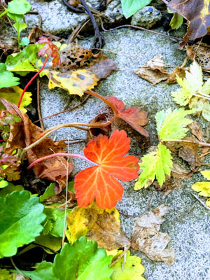
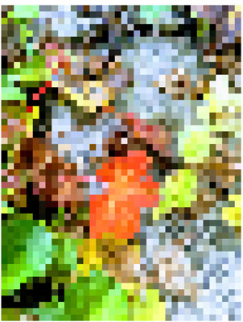
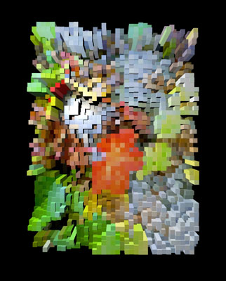
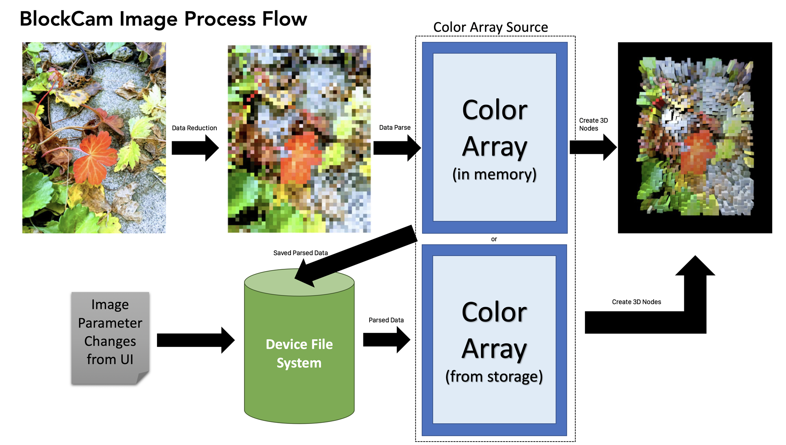
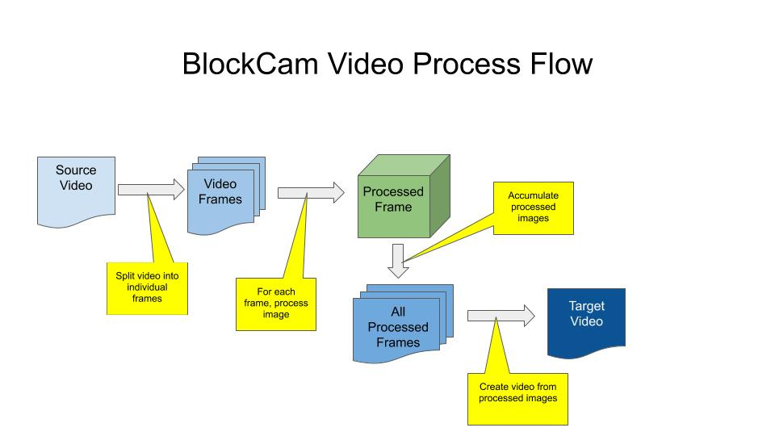

# BlockCam ([日本語](#block_cam)) 

**3D Block Camera**

BlockCam is a camera program for iOS and iPadOS that takes images via AVFoundation and then converts those images into simple 3D scenes. The scenes may be rotated and scaled by the user, and saved as a flat image.

BlockCam was written by Stuart Rankin.

## Versioning

Versioning for BlockCam is maintained in the `Versioning.swift` file and is automatically updated with each build as a pre-build script step. The updating includes build IDs, build numbers, times and dates, but version numbers must currently be updated by hand. The current build string below is also maintained by the same mechanism.

The versioning program does not currently update the BlockCam project file's version numbers.

Most recent build: **Version 0.8 Alpha, Build 1612, Build date: 29 January 2020, 10:56**

> See [VersionUpdater](https://github.com/sjrankin/VersionUpdater) repository on GitHub for information on how versions and builds are updated.

## Privacy

BlockCam is designed to contain user-supplied information as much as possible. Any time user-identifiable information is used, BlockCam will ask for it explicitly. By design, BlockCam does not collect *any* user-identifiable information by default; the user *must* take active steps to allow collection of this type of information.

|Identifiable Information|Use|Storage|
|:--|:--|:--|
|User Name|The user's name (entered by the user) to be stored in processed image metadata.|Stored in `UserDefaults`.|
|User Copyright|The user's copyright string (entered by the user) to be stored in processed image metadata.|Stored in `UserDefaults`.|

## Program Flow

When the user instantiates BlockCam, it opens in live view mode (showing the view of the camera on the main screen). The user has the option of choosing one of three modes:

1. **Live View Mode** This is the default mode and allows the user to take pictures of whatever the program shows. Once the picture is taken, it is processed then displayed in the view.
2. **Album Mode** This mode allows the user to select an image from the camera roll on the device. That image is then processed the same way as a live view image would be. The user can also convert an existing video.
3. **Video Mode** *Not currently implemented*. This mode allows users to make videos with the normal iOS/iPadOS video interface and process the video using the current settings.
4. ~~**Processed Mode** *Not currently implemented*. This is intended to allow the user to view the output of the live view feed processed into a 3D scene. Given the slowness of the processing, this may not be feasible except for when running on faster, future platforms (or on a desktop system).~~

## Platforms

BlockCam has been tested on the following platforms:

- iPhone 6S+ with iOS 13.3
- iPhone 8 with iOS 13.3
- iPad Mini 4 with iPadOS 13.3
- iPad Pro 9.7 with iPadOS 13.3
- macOS 10.15.2 via MacCatalyst (see, however, Issues).

## Issues

1. The main issue is one of performance. When used on images of large size on older cell phones, performance slows dramatically. However, the selfie camera is actually very quick. BlockCam has certain mitigations in place (such as user settings) to help reduce some performance issues.
2. *Kanji is extraordinarily slow.* To create an extruded image using kanji characters takes on the order of 6 minutes for an older iPhone.
3. Only tested on the following: iPhone 6S+, iPhone 8, iPad Mini 4. iPad Pro 9.7.
4. MacCatalyst does not support AVFoundation usage of the Mac camera, making things quite difficult. Work on the MacCatalyst version has stopped for now due to that impedement.
5. Histograms are not yet implemented.
6. Non-built-in geometric shapes seem to perform significantly slower than built-in shapes.
7. iPadOS and iOS 13 seem to have a few extra debug statements left in them that lead to confusing debug sessions - specifically, "Can't end BackgroundTask" messages.

## Future Plans

1. Add more shapes, such as ~~stars~~ or hearts and the like.
 - Stars added - use `UIBezierPath` to add more shapes.
2. Add a processed-live view mode that shows a live view (similar to the photo mode right now) only processed. This will probably be very power hungry and slow and may work reliably only on the most recent hardware.
3. Share videos - right now, only images can be shared.
4. ~~Fully implement usage of pixellated data. Most code is in place. This feature saves processed image data at the pixellation level (eg, colors for each pixel region) as a file in the user's file system space. The advantage is to quicken processing when the user changes certain settings, such as shape or extrusion depth.~~ Done.

## Performance

There are four performance concerns for BlockCam:

1. **Memory** This concern is mainly for video processing. Currently, BlockCam reads all frames of a video to process and resizes them as required, saving resized images in memory. By placing memory-intensive code in loops in `autoreleasepool` blocks, most concerns have been addressed. If it turns out that this is insufficient, a mitigation plan exists: Save all scratch images to local storage then read them singly and process them one at a time. This will slow things down but reduce memory pressure.
2. **Time** It takes a significant amount of time to process one image, especially if that image is large. The user interface provides controls for the user to reduce the size of the image to process.　Additionally, the user interface provides hints to the user with respect to which options are slower than others.
3. **Thermal** Since BlockCam makes heavy use of the graphics processor, it is possible to overheat the device. When this happens (and if default settings have not been changed), BlockCam will immediately exit when the thermal condition becomes critical.
4. **Power** Due to the same causes of thermal issues, the battery may be drained quickly when using BlockCam. If default settings are in place and the device enters a low power state, BlockCam will immediately exit.

## Theory of Operation

BlockCam converts each image that is taken into a pixellated image via CoreImage filter `CIPixellate`. After pixellation, the processing algorithm then calculates the height determinate - the height determines either the size of a node or the extrusion of a node. Then, each pixel from the pixellated image is converted into a 3D shape (set by the user) and then added to the current scene in the 3D view.

All processing operations make use of the same code but may be called differently (or multiple times) depending on the user-facing mode in effect.

### Step 1: Image Acquisition

An image is acquired for processing. The source of the image is not important so long as it is a standard, iOS/iPadOS-readable image. The most common source of images will most likely be the live view camera. Other sources are the photo album and video frames.

The following image is the source for the processing. (This is an image I took of our garden in early winter.)

### Step 2: Image Conditioning

Given the performance expense of converting the image, the user has the option of reducing the amount of work done by having the source image resized to a smaller size. This may also occur without the user's intervention should videos be processed. (Processing videos tends to take a lot of memory, so even saving a few percent per image will help keep things less stressful on the system.) Some images are also rotated to 270° (or -90° if you prefer) and need to be rotated correctly. This is also done in the image conditioning step.

### Step 3: Image Pixellation

The processed image is then pixellated via Core Image filter functions. Specifically, the most common filter BlockCam uses is `CIPixellate` (although other pixellation filters are used depending on the final shape). The size of each pixellated region is depending on user settings. The smaller the size, the greater the impact on overall performance, though `CIPixellate` (and like filters) are still very fast. The reason why smaller pixellated regions increase performance is because more 3D nodes will be required later on.

The following image shows the pixellation of the original image. Note that each pixellated region is a solid color, which means BlockCam does not have to read the entire region to get the color - just one pixel.

### Step 4: Image Parsing

The pixellated image is then parsed. This entails getting the color of each pixellated region. This is a slower than expected step. Getting individual pixel data from an image requires a great deal of image data manipulation just to get the image ready to be queried. At the end of this step, images are no longer used. A 2D array of color data is passed to the next step.

At this step, pixellated image data is saved to local file storage. This is to simplify minor visual changes later requested by the user.

### Step 5: 3D Node Generation

The final node shape is a user setting. BlockCam allows users to select from one of many shapes - the built-in shapes tend to run faster than non-built-in shapes (for example, spheres are faster than pentagons). A 3D node is generated for each color from the Image Parsing step using the specified geometry. In order to show off the 3D-ness of the final scene, nodes are exaggerated in some dimension. For example, if cubes are the shape selected by the user, the length will be exaggerated. Exaggeration is determined by the color - the color is used to shade the diffuse surface of the node as well as to determine the height. Exaggeration is determined by a user-selectable determinant:

- **Hue** - The hue determines the exaggeration. This tends to lead to reds that are very tall as well as very short, given where reds live in the HSB hue circle.
- **Saturation** - Brightly color pixellated areas tend to be highlighted.
- **Brightness** - This is the default determinant and probably the best - the brightness of the color of the pixellate region determines the exaggeration so bright areas are highest.
- **Red, Green, Blue** - The specified RGB color channel is used as the exaggeration determinant.
- **Cyan, Magenta, Yellow, Black** - The specified CMYK color channel is used as the exaggeration determinant (with Black leading to some very strange-looking results). (While some calculation is required to convert from RGB to CMYK, the amount is relatively minor and does not adversely affect performance.)

Once a node has been created, it is added to a master node. Once all nodes have been created and placed in to the master node, the master node itself is placed in to the 3D scene.

- A master node is used to make later animations an order of magnitude easier to manage.

### Step 6: Display

While this may seem a trivial step, it is very tricky when converting videos. If converting an image, All that happens is the 3D scene is updated and eventually shown to the user (usually within 0.5 to 2.0 seconds). For videos, it is critical to get the timing of the display right: to convert a video, each frame is run through these steps and then a snapshot is taken of the 3D scene. If the snapshot is taken before the scene has been displayed, the result will be a pure black image, which isn't what the user wants to see. Therefore, BlockCam must participate in the `SCNSceneRendererDelegate` set of functions to know when a scene is actually visible to the user.

The following image is the final, processed version of the image. This is the output of a `snapshot()` call on the SCNView. The sample uses extruded blocks and is being viewed in the default camera orientation.

### Step 7: Image Disposition

Once the image is display, the user has the option to save it as is or edit some visual aspects or rotate or zoom in or out, and then save it (again, perhaps). For videos, once a snapshot of the 3D scene is captured, the scene is disposed of.

#### Step 7a: Saving Processed Images

Depending on the value of `.SaveOriginalImageAction`, the original image will be saved. When the user saves the processed image, metadata is saved along with the processed image. The metadata consists of the name and version of the program as well as the parameters in effect when the image was created.

Saving processed files is a multi-step process:

1. The image is saved in the `/Scratch` directory as a standard `.jpg` file.
2. Metadata is added to the saved image which is then resaved as a different file (still as a `.jpg` file).
3. The original file is deleted.
4. The modified file is then copied to the photo roll (using `PHAssetCreationRequest`  with the appropriate parameters set - this is needed because the more common method to move images to the photo roll strips Exif data).
5. On success, the modified is deleted from the `/Scratch` directory.

### Metadata

BlockCam saves metadata in processed files.

|Group|Tag|Stored values|
|:--|:--|:--|
|TIFF|Artist|If enabled by the user, the user's name.|
|TIFF|Copyright|If enabled by the user, the user's copyright string.|
|TIFF|Software|BlockCam's name, version, and build numbers.|
|Exif|UserComment|List of parameters used to generate the processed image.|

> See also the [Privacy](#Privacy) discussion.

## Flow Diagrams

### Image Flow

A simplified flow diagram for image processing is shown below.

#### Performance Optimization

Due to the amount of time it takes to preprocess and pixellate an image, every time a new image is processed, pixellation data (consisting of an array of colors) is saved to the device's file system. If the user then changes a parameter (such as a 3D shape), preprocessing has already been completed and the pixellation data is reused. This can potentially save a great deal of time.

> If the user changes a parameter that affects preprocessing, the image is reprocessed from the beginning. (For example, the changing the block size will cause a full reprocessing cycle to be executed.)

### Video Flow

A simplified flow diagram for video processing is shown below. The cube refers back to the Image Flow.

**Currently, the green box ("Processed Frame") does not function as expected/required so as of current writing, video creation is not supported.**

## Logging

BlockCam logs messages and status at runtime to the debug console (if present, and in the vast majority of instances, this will not be present) and to a local SQLite database. This allows for
post-mortem debugging should the need arise.

Given Apple's policy on data rentention (not to mention the EU's policies), it is entirely likely logging will be removed (via compile-time flags) for any released version of BlockCam.

## Settings

All user settings (and a few process settings) are stored via the `Settings` class. This class encapsulates a storage mechanism that is invisible to the rest of the program. Currently, the storage mechanism is `UserDefaults`. Should settings become more complex, it is straightforward to migrate this to a database.

To access settings, callers must use the provided methods of the `Settings` class. This helps to ensure data type integrity. 

The `Settings` class also provides setting-level notification of changes (which was the primary reason to create the class in the first place).

### Settings Dictionary

BlockCam settings are presented below.

|Symbol|Type|Default|Usage|
|:--|:--|:--|:--|
|.Initialized|String|"Initialized"|Flag that determines whether settings have been initialized or not. When BlockCam first runs, if `.Initialized` is nil or empty, it assumes it is the first time BlockCam has been run and so therefore writes default values for all settings.|
|.BlockSize|Integer|48|Block size for image processing. This is the square size of each pixellated region.|
|.ShapeType|String|"Blocks"|The same of the 3D object at each pixellation region. Cast from an enum.|
|.InvertHeight|Boolean|false|The invert height/size determination flag.|
|.HeightSource|String|"Brightness"|The color channel to use to determine height/size. Cast from an enum.|
|.ImageSizeConstraints|String|"Medium"|Determines the amount of reduction in size of the image to do before processing it for performance reasons. Cast from an enum. Actual value interpreted at run time.|
|.VerticalExaggeration|String|"Medium"|The amount of vertical exaggeration to perform when extruding or enlarging 3D shapes. Cast from an enum.|
|.InputQuality|Integer|2|Value that indicates the input quality. Ranges from 0 to 3 with 3 being the highest quality (and slowest to process).|
|.CurrentCamera|String|"Back"|The position of the last camera used. Either front or back. Cast from an enum.|
|.LightColor|String|"White"|Name of the color of the light. Cast from an enum. May be converted to a color library type of color later.|
|.LightType|String|"Omni"|Name of the type of light used to illuminate the scene. Cast from an enum.|
|.LightIntensity|String|"Normal"|Intensity of the light used to illuminate the scene. Actual value determined at runtime. Cast from an enum.|
|.FieldOfView|String|"Normal"|Field of view of the camera. Actual value is determined at runtime. Cast from an enum.|
|.ShowHistogram|Boolean|false|Show the histogram display. Not currently implemented.|
|.HistogramBucketCount|Integer|256|Number of colors in the histogram display. Not currently implemented.|
|.InitialView|String|"LiveView"|The last view seen by the user (such as live view, albums, etc).|
|.FullyExtrudeLetters|Boolean|true|Determines if letters are fully extruded or only partially extruded.|
|.LetterSmoothness|String|"Smooth"|Determines how smoothly to create curves in letters. High quality curves comes at a large performance cost. Actual value determined at runtime. Cast from an enum.|
|.LetterFont|String|"Futura"|The font (and optional weight) to use to render extruded letters. If the font does not exist on the system, BlockCam will enter an undefined state.|
|.RandomCharacterSource|String|"Latin"|Named Unicode range of characters to use as a source for random letters when extruding characters. Multiple ranges may be specified by separating each from the others with a comma.|
|.VideoFPS|Integer|1|Not currently used.|
|.VideoDimensions|String|"Smallest"|Determines the final video size when generating video. Actual value determined at runtime. Cast from an enum.|
|.VideoBlockSize|Integer|48|Block size for video processing. This is the square size of each pixellated region.|
|.UseMetal|Boolean|true|Flag that tells BlockCam to use Metal rather than OpenGL.|
|.AntialiasingMode|Integer|0|Determines the antialiasing mode.|
|.InitialBestFit|Boolean|false|If true, BlockCam will try to fit all nodes into the view with as tightly as possible.|
|.SaveOriginalImageAction|String|"Always"|Determines how and when to save original images. Cast from an enum.|
|.NextSequentialInteger|Integer|0|Used for file name generation.|
|.LoopSequentialIntegerAfter|Integer|9999|Determines when to loop to the start when using sequential integers.|
|.StartSequentialIntegerAt|Integer|1|Starting value for sequential integers.|
|.IncreaseStarApexesWithProminence|Boolean|false|If true, the number of apexes for star shapes increases with the prominence of the color height.|
|.StarApexCount|Integer|5|Number of apexes for stars. If `.IncreaseStarApexesWithProminence` is true, this is the starting number of apexes.|
|.HaltWhenCriticalThermal|Boolean|true|If true, BlockCam will halt (via a `fatalError` call) when it receives a critical thermal alert. This may violate Apple guidelines and may be removed.|
|.HaltOnLowPower|Boolean|true|If true, BlockCam will halt (via a `fatalError` call) when it receives a low power alert. This may violate Apple guidelines and may be removed.|
|.BestFitOffset|Double|2.0|Value to use to back the camera away when `.InitialBestFit` is true to give a bit more negative space to the image.|
|.LightingModel|String|"Phong"|Surface material lighting model. Cast from an enum.|
|.CappedLineBallLocation|String|"Top"|Location of the ball ("cap") for CappedLine shaped nodes. Cast from an enum.|
|.LoggingEnabled|Boolean|false|Enable logging flag.|
|.FontSize|Integer|36|The font size for extruded letters.|
|.EnableUISounds|Boolean|true|Flag to play UI sounds (such as when a button is pressed). If this value is `false`, all other sound flags are ignored.|
|.EnableShutterSound|Boolean|false|Flag to play a shutter sound when the camera button is pressed. In some geographic locations, this always happens and setting this value will have no effect.|
|.EnableImageProcessingSound|Boolean|true|Flag to play a sound at the start and end of image processing. Since image processing is time-consuming, this helps the user understand when the image is completed.|
|.EnableVideoRecordingSound|Boolean|true|Flag to play a sound when the user starts and stops recording a video.|
|.EnableButtonPressSounds|Boolean|true|Flag to play a sound when the user presses buttons.|
|.EnableOptionSelectSounds|Boolean|true|Flag to play a sound when the user selects an option in the on-screen settings display.|
|.EnableCrashSounds|Boolean|false|Flag to play a sound when a crash dialog is shown. Enabled only when compiled in **#DEBUG** mode.|
|.MeshDotSize|String|"Medium"|Size of the center dot for meshes. If `.None` is used, no center dot will be displayed. Cast from an enum.|
|.MeshLineThickness|String|"Medium"|Thickness of mesh lines. Cast from an enum.|
|.RadiatingLineThickness|String|"Medium"|Thickness of radiating line shapes. Cast from an enum.|
|.RadiatingLineCount|Integer|8|Number of radiating lines in a radiating line shape. `4` is for lines pointing towards the cardinal directions, `8` for the cardinal directions and inbetween, and `16` for 8 more lines in the z-plane.|
|.BlockChamferSize|String|"None"|The chamfer radius/edge smoothness for block shapes. Cast from an enum.|
|.MaxImageDimension|Integer|1024|Maximum dimension of an image. If an image to process is larger, it will be resized such that the longest dimension is this value.|
|.AddUserDataToExif|Boolean|false|Flag to add user-created information to processed images' Exif block. If compiled in #DEBUG mode, this value defaults to true.|
|.UserName|String|""|(Default is blank.) The user-supplied name that is added to processed images' Exif block. This happens only if  `.AddUserDataToExif` is true. If compiled in #DEBUG mode, this value defaults to "Stuart Rankin".|
|.UserCopyright|String|""|(Default is blank.) The user-supplied copyright string that is added to processed images' Exif block. This happens only if  `.AddUserDataToExif` is true. If compiled in #DEBUG mode, this value defaults to "Attribution 3.0 Unported (CC BY 3.0)".|
|.ConeIsInverted|Boolean|true|Determines if cone-shapes are inverted in terms of z depth.|
|.ConeTopOptions|String|`.TopIsZero`.rawValue|Options for determining the top radius of the cone.|
|.ConeBaseOptions|String|`.BaseIsSide`.rawValue|Options for determining the base radius of the cone.|
|.ShowSplashScreen|Boolean|true|Flag that determines whether the splash screen is shown at start up or not.|
|.HueShapeList|String|""|List of shapes for the hue variant shape type.|
|.SaturationShapeList|String|""|List of shapes for the saturation variant shape type.|
|.BrightnessShapeList|String|""|List of shapes for the brightness variant shape type.|

## System Management

BlockCam uses 3D processing, which exercises the device's graphics chip. If the user specifies highest quality settings, it is possible certain extreme conditions may occur. To help preserve the device from damage, settings are available to abort execution of BlockCam when that happens.

|Event|Action|Controlling Setting|
|:--|:--|:--|
|Thermal|If a thermal event reaches the critical stage (literally `.critical` in the notification), if the setting is `true`, a fatal error will be generated to reduce any thermal stress created by BlockCam.|`.HaltWhenTooHot`|
|Battery|If the battery enters a low power state, if the setting is `true`, a fatal error will be generated to help preserve the battery's life before recharging.|`.HaltOnLowPower`|

## Supported Visuals

BlockCam supports the following visuals:

### Shapes

The following shapes are currently supported (or planned to be supported) for extrusion effects:

|Shape|Native|Notes|
|:--|:--|:--|
|Blocks|Yes - `SCNBox`|Native box shapes lengthened along the Z axis.|
|Triangles|No|Custom equilateral triangle shapes.|
|Pentagons|No|Custom equilateral pentagon shapes.|
|Hexagons|No|Custom equilateral hexagonal shapes.|
|Octogons|No|Custom equilateral octagonal shapes.|
|Pyramids|Yes - `SCNPyramid`|Native pyramid shapes.|
|Toroids|Yes - `SCNTorus`|Native torus shapes.|
|Cylinders|Yes - `SCNCylinder`|Native cylinder shapes - makes for nice elevated circles.|
|Spheres|Yes - `SCNSphere`|Native sphere shapes.|
|Capsules|Yes - `SCNCapsule`|Native capsule shapes. Not as interesting as they sound.|
|Tetrahedrons|No|Custom equilateral tetrahedron solid.|
|Stars|No|Custom star shapes (with radially equal apexes). Can vary the number of apexes.|
|CombinedForRGB|Yes - combination|Combined sphere, torus, and capsule.|
|CombinedForHSB|Yes - combination|Combined sphere, torus, and capsule.|
|Meshes|No|Not currently implemented.|
|Letters|Yes - `SCNText`|Native extruded text. Tends to be extraordinarily slow, especially with non-Latin alphabets.|
|Lines|Yes - `SCNCapsule`|*Very* thin capsule shape.|
|CappedLines|Yes - combination|*Very* thin capsule shape with a sphere placed at the top, middle, or bottom of the line depending on user settings.|
|RadiatingLines|Yes - combination|Multiple lines radiating from the center point. User can specify how many lines. This is a performance-heavy shape.|
|HueVarying|variants|The shape at a given point is determined by the hue of the pixellated region so the actual final shape will vary.|
|SaturationVarying|variants|The shape at a given point is determined by the saturation of the pixellated region so the actual final shape will vary.|
|BrightnessVarying|variants|The shape at a given point is determined by the brightness of the pixellated region so the actual final shape will vary.|

### Extrusions/Depth Determination

Each shape for a representative pixellated region is extruded or enlarged. The determination of the extrusion depth or enlarged size depends on the color of the pixellated region.

|Color Channel|Usage|
|:--|:--|
|Hue|The hue of the color determines the depth/size of the 3D object. Note that hue values are cyclical (with 0.0 being essentially the same as 1.0) so reddish pixels tend to be subdued while green are highlighted.|
|Saturation|The color saturation value determines depth/size. Brighter colors will be bigger.|
|Brightness|The brightness of the color determines depth/size. This is the default value and how most people would expect the program to work.|
|Red|The red channel is used to determine depth/size.|
|Green|The green channel is used to determine depth/size.|
|Blue|The blue channel is used to determine depth/size.|
|Cyan|A synthetic cyan channel (from CMYK) is used to determine depth/size.|
|Magenta|A synthetic magenta channel (from CMYK) is used to determine depth/size.|
|Yellow|A synthetic yellow channel (from CMYK) is used to determine depth/size.|
|Black|A synthetic black channel (from CMYK) is used to determine depth/size.|
|YUV: Y|The synthetic **Y** channel from a YUV conversion.|
|YUV: U|The synthetic **U** channel from a YUV conversion.|
|YUV: V|The synthetic **V** channel from a YUV conversion.|

> BlockCam supports an inverted flag. This means if the user sets invert, the depth/size is a reciprocol of itself, making dark areas prominent and light areas subdued or hidden.

### Lighting

BlockCam supports changing the color of the light as well as the type of the light. Colors are currently restricted to a small set of pre-defined colors. The types of lights parallel SceneKit's standard, non-parametized lights (such as `.omni` and  `.spot`).

The light's position is not currently adjustable by the user.

### Image Rotation

BlockCam makes use of `SCNView`'s `allowsCameraControl` flag to let the user enlarge, shink, or rotate (in three axes) by way of gestures.

When initially rendered, the result may appear to be relatively far away from the view. BlockCam has a user-settable flag to fit the image to the view. This feature tends to confuse `allowsCameraControl` with respect to enlarging and shrinking.

## Implementation

This section will discuss various implementation-level details.

### Source

BlockCam was written in Swift 5 with Xcode 11.3.

### Threading

Given the lengthy amount of time it takes to process images, all image processing is done on a background thread. This requires all communication to update the user via the UI to be done with the proper threading calls.

### Project Structure

TBD

## Legal

BlockCam is copyright © 2019, 2020 by Stuart Rankin

---

# Block_Cam
日本語版 «Google翻訳で翻訳»

**3Dブロックカメラ**

BlockCamはiOSおよびiPadOS用のカメラプログラムで、AVFoundationを介して画像を取得し、それらの画像を単純な3Dシーンに変換します。シーンは、ユーザーによって回転および拡大縮小され、フラットイメージとして保存されます。

BlockCamはStuart Rankinによって作成されました。

## バージョン管理

BlockCamのバージョン管理は `Versioning.swift`ファイルで管理され、ビルド前のスクリプトステップとしてビルドごとに自動的に更新されます。 更新にはビルドID、ビルド番号、時刻、日付が含まれますが、現在、バージョン番号は手動で更新する必要があります。 以下の現在のビルド文字列も同じメカニズムによって維持されます。

現在、バージョン管理プログラムはBlockCamプロジェクトファイルのバージョン番号を更新しません。

最新のビルド：バージョン情報については、英語のセクションを参照してください。

> バージョンとビルドの更新方法については、GitHubの[VersionUpdater]（https://github.com/sjrankin/VersionUpdater）リポジトリを参照してください。

## プライバシー

BlockCamは、可能な限りユーザーが提供する情報を含むように設計されています。 ユーザーを特定できる情報が使用されるたびに、BlockCamはそれを明示的に要求します。 設計上、BlockCamはデフォルトで*ユーザー*を特定できる情報を収集しません。 ユーザーは、このタイプの情報の収集を許可するためにアクティブな手順を実行する必要があります。

|識別情報|使用|保管|
|:--|:--|:--|
|ユーザー名|処理された画像のメタデータに保存されるユーザーの名前（ユーザーが入力）。|「UserDefaults」に保存されます。|
|ユーザー著作権|処理された画像メタデータに保存されるユーザーの著作権文字列（ユーザーが入力）。|「UserDefaults」に保存されます。|

## プログラムの流れ

ユーザーがBlockCamをインスタンス化すると、ライブビューモードで開きます（メイン画面にカメラのビューを表示）。ユーザーには、次の3つのモードのいずれかを選択するオプションがあります。

1. **ライブビューモード**これはデフォルトのモードであり、ユーザーはプログラムが表示するものを何でも写真に撮ることができます。 写真が撮影されると、処理されてビューに表示されます。
2. **アルバムモード**このモードでは、ユーザーはデバイスのカメラロールから画像を選択できます。 その画像は、ライブビュー画像と同じ方法で処理されます。 ユーザーは既存のビデオを変換することもできます。
3. **ビデオモード** *現在実装されていません*。 このモードでは、ユーザーは通常のiOS / iPadOSビデオインターフェイスでビデオを作成し、現在の設定を使用してビデオを処理できます。
~~4. **処理モード** *現在実装されていません*。 これは、3Dシーンに処理されたライブビューフィードの出力をユーザーが表示できるようにすることを目的としています。 処理が遅いことを考えると、これは、より高速の将来のプラットフォーム（またはデスクトップシステム）で実行する場合を除いて、実行不可能な場合があります。~~

## プラットフォーム

BlockCamは、次のプラットフォームでテストされています。

- iOS 13.3を搭載したiPhone 6S +
- iOS 13.3を搭載したiPhone 8
- iPadOS 13.3を搭載したiPad Mini 4
- iPadOS 13.3を搭載したiPad Pro 9.7

## 問題

1.主な問題はパフォーマンスです。 古い携帯電話の大きなサイズの画像で使用すると、パフォーマンスが大幅に低下します。 ただし、セルフィーカメラは実際には非常に高速です。 BlockCamには、パフォーマンスの問題を軽減するのに役立つ特定の軽減策（ユーザー設定など）があります。
2. *漢字は非常に遅いです。*漢字を使用して押し出し画像を作成するには、古いiPhoneの場合、6分程度かかります。
3.以下でのみテスト済み：iPhone 6S +、iPhone 8、iPad Mini4。iPadPro 9.7。
4. MacCatalystは、MacカメラのAVFoundationの使用をサポートしていないため、非常に困難です。 MacCatalystバージョンでの作業は、その妨害のため現在のところ停止しています。
5.ヒストグラムはまだ実装されていません。
6.非組み込みの幾何学的図形は、組み込みの図形よりも大幅に遅いように見えます。
7. iPadOSおよびiOS 13には、混乱するデバッグセッションにつながるいくつかの追加のデバッグステートメントが残っているようです。具体的には、「BackgroundTaskを終了できません」メッセージです。

##  今後の計画

1. ~~星~~やハートなどの図形を追加します。
  -スターが追加されました-`UIBezierPath`を使用してさらにシェイプを追加します。
  2.処理済みのライブビュー（現在の写真モードと同様）のみを表示する処理済みライブビューモードを追加します。 これはおそらく非常に電力を消費し、遅くなり、最新のハードウェアでのみ確実に動作する可能性があります。
  3.ビデオを共有する-現在、画像のみを共有できます。
  4.ピクセル化されたデータの使用を完全に実装します。 ほとんどのコードが配置されています。 この機能は、処理された画像データをピクセル化レベル（たとえば、各ピクセル領域の色）でユーザーのファイルシステム空間にファイルとして保存します。 利点は、形状や押し出しの深さなどの特定の設定をユーザーが変更したときに処理を高速化することです。

## パフォーマンス

BlockCamには、パフォーマンスに関する4つの懸念事項があります。

1. **メモリ**この懸念は主にビデオ処理に関するものです。現在、BlockCamはビデオのすべてのフレームを読み取って処理し、必要に応じてサイズを変更して、サイズ変更された画像をメモリに保存します。メモリを大量に消費するコードを「autoreleasepool」ブロックのループに配置することで、ほとんどの懸念事項に対処しました。これが不十分であることが判明した場合、軽減計画が存在します。すべてのスクラッチイメージをローカルストレージに保存し、それらを1つずつ読み取り、一度に1つずつ処理します。これにより速度は低下しますが、メモリの負荷は軽減されます。
2. **時間** 1つの画像の処理には、特にその画像が大きい場合、かなりの時間がかかります。ユーザーインターフェイスは、処理する画像のサイズを縮小するためのコントロールをユーザーに提供します。さらに、ユーザーインターフェイスは、他のオプションよりも遅いオプションに関してユーザーにヒントを提供します。
3. **熱** BlockCamはグラフィックプロセッサを多用するため、デバイスが過熱する可能性があります。これが発生した場合（およびデフォルト設定が変更されていない場合）、温度条件が重大になるとBlockCamはすぐに終了します。
4. **電力**熱問題の同じ原因により、BlockCamを使用すると、バッテリーがすぐに消耗する場合があります。デフォルト設定が設定されていて、デバイスが低電力状態になると、BlockCamはすぐに終了します。

## 操作の理論

BlockCamは、取り込まれた各画像をCoreImageフィルター `CIPixellate`を介してピクセル化された画像に変換します。 ピクセル化の後、処理アルゴリズムは高さの決定を計算します-高さはノードのサイズまたはノードの押し出しを決定します。 次に、ピクセル化された画像の各ピクセルが3D形状（ユーザーが設定）に変換され、3Dビューの現在のシーンに追加されます。

すべての処理操作は同じコードを使用しますが、有効なユーザー向けモードに応じて異なる方法（または複数回）で呼び出すことができます。

### ステップ1：画像の取得

処理のために画像が取得されます。画像のソースは、iOS / iPadOSで読み取り可能な標準の画像である限り重要ではありません。画像の最も一般的なソースは、おそらくライブビューカメラです。他のソースは、フォトアルバムとビデオフレームです。

次の画像は、処理のソースです。 （これは私が初冬に庭で撮った画像です。）

### ステップ2：画像調整

画像を変換するためのパフォーマンスの犠牲を考えると、ユーザーはソース画像をより小さなサイズにサイズ変更することにより、実行される作業量を削減するオプションがあります。これは、ビデオが処理される場合、ユーザーの介入なしに発生することもあります。 （ビデオの処理は多くのメモリを消費する傾向があるため、画像ごとに数パーセントを保存してもシステムのストレスを軽減できます。）一部の画像は270°（または必要に応じて-90°）に回転され、正しく回転します。これは、画像調整ステップでも行われます。

### ステップ3：画像のピクセル化

処理された画像は、Core Imageフィルター関数を介してピクセル化されます。具体的には、BlockCamが使用する最も一般的なフィルターは「CIPixellate」です（ただし、最終的な形状に応じて他のピクセル化フィルターが使用されます）。各ピクセル化領域のサイズは、ユーザー設定によって異なります。サイズが小さいほど、全体的なパフォーマンスへの影響は大きくなりますが、「CIPixellate」（およびフィルターと同様）は依然として非常に高速です。ピクセル化された領域が小さくなるとパフォーマンスが向上する理由は、後でより多くの3Dノードが必要になるためです。

次の画像は、元の画像のピクセル化を示しています。各ピクセル化された領域は単色であることに注意してください。つまり、BlockCamは領域全体を読み取って色を取得する必要はなく、1ピクセルだけです。

### ステップ4：画像解析

次に、ピクセル化された画像が解析されます。これには、ピクセル化された各領域の色を取得する必要があります。これは予想よりも遅いステップです。画像から個々のピクセルデータを取得するには、画像を照会できるようにするためだけに大量の画像データ操作が必要です。この手順の最後に、画像は使用されなくなります。カラーデータの2D配列が次のステップに渡されます。

このステップでは、ピクセル化された画像データがローカルファイルストレージに保存されます。 これは、後でユーザーが要求する小さな視覚的な変更を簡素化するためです。

### ステップ5：3Dノードの生成

最終的なノード形状はユーザー設定です。 BlockCamを使用すると、ユーザーは多くの形状のいずれかを選択できます。組み込みの形状は、非組み込みの形状よりも速く動作する傾向があります（たとえば、球体は五角形よりも高速です）。指定したジオメトリを使用して、イメージ解析ステップから各色の3Dノードが生成されます。最終シーンの3D性を誇示するために、ノードはある次元で誇張されています。たとえば、キュ​​ーブがユーザーが選択した形状である場合、長さは誇張されます。誇張は色によって決定されます-色は、ノードの拡散表面を陰影付けするために、また高さを決定するために使用されます。誇張は、ユーザーが選択可能な決定要因によって決定されます。

- **色相** 色相は誇張を決定します。これは、赤がHSB色相環のどこに存在するかを考えると、非常に背が高いだけでなく非常に短い赤につながる傾向があります。
- **彩度** 明るい色のピクセル化された領域が強調表示される傾向があります。
- **明るさ** これはデフォルトの決定要因であり、おそらく最良です-ピクセル領域の色の明るさが誇張を決定するため、明るい領域が最も高くなります。
- **赤、緑、青** 指定されたRGBカラーチャネルが誇張の決定要因として使用されます。
- **シアン、マゼンタ、イエロー、ブラック** 指定されたCMYKカラーチャンネルが誇張の決定要因として使用されます（ブラックは非常に奇妙な結果になります）。 （RGBからCMYKに変換するには計算が必要ですが、その量は比較的少なく、パフォーマンスに悪影響を与えません。）

ノードが作成されると、そのノードはマスターノードに追加されます。すべてのノードが作成されてマスターノードに配置されると、マスターノード自体が3Dシーンに配置されます。

-マスターノードは、後のアニメーションを管理しやすくするために使用されます。

### ステップ6：表示

これは簡単な手順のように思えるかもしれませんが、ビデオを変換するときは非常に注意が必要です。画像を変換すると、3Dシーンが更新され、最終的にユーザーに表示されます（通常は0.5〜2.0秒以内）。ビデオの場合、ディスプレイのタイミングを正確にすることが重要です。ビデオを変換するには、各フレームをこれらの手順で実行し、3Dシーンのスナップショットを取得します。シーンが表示される前にスナップショットが撮られた場合、結果は純粋な黒のイメージになりますが、これはユーザーが見たいものではありません。したがって、BlockCamは `SCNSceneRendererDelegate`関数セットに参加して、シーンが実際にユーザーに表示されるタイミングを知る必要があります。

次の画像は、画像の最終的な処理済みバージョンです。これは、SCNViewでの `snapshot（）`呼び出しの出力です。サンプルは押し出しブロックを使用し、デフォルトのカメラの向きで表示されています。

### ステップ7：画像の配置

画像が表示されると、ユーザーはそれをそのまま保存するか、いくつかの視覚的側面を編集するか、回転またはズームインまたはズームアウトしてから保存する（おそらくもう一度）オプションがあります。ビデオの場合、3Dシーンのスナップショットがキャプチャされると、シーンは破棄されます。

#### ステップ7a：処理済み画像を保存する

`.SaveOriginalImageAction`の値に応じて、元の画像が保存されます。 ユーザーが処理された画像を保存すると、メタデータは処理された画像とともに保存されます。 メタデータは、プログラムの名前とバージョン、およびイメージの作成時に有効なパラメーターで構成されます。

処理されたファイルの保存は、複数ステップのプロセスです。

1. 画像は標準の  `.jpg` ファイルとして` /Scratch` ディレクトリに保存されます。
2. メタデータが保存された画像に追加され、その後、別のファイルとして再保存されます（ `.jpg`ファイルとして）。
3. 元のファイルが削除されます。
4. 変更されたファイルは写真ロールにコピーされます（適切なパラメーターを設定した `PHAssetCreationRequest`を使用します-写真ロールに画像を移動するより一般的な方法はExifデータを削除するためです）。
5. 成功すると、変更されたファイルは `/Scratch` ディレクトリから削除されます。

### メタデータ

BlockCamは、処理されたファイルにメタデータを保存します。

|グループ|タグ|保存された値|
|:--|:--|:--|
| TIFF |アーティスト|ユーザーが有効にした場合、ユーザーの名前。|
| TIFF |著作権|ユーザーが有効にした場合、ユーザーの著作権文字列。|
| TIFF |ソフトウェア| BlockCamの名前、バージョン、ビルド番号。|
| Exif | UserComment |処理済み画像の生成に使用されるパラメーターのリスト。|

#### パフォーマンスの最適化

画像の前処理とピクセル化には時間がかかるため、新しい画像が処理されるたびに、ピクセル化データ（色の配列で構成される）がデバイスのファイルシステムに保存されます。 その後、ユーザーがパラメーター（3D形状など）を変更した場合、前処理は既に完了しており、ピクセル化データは再利用されます。 これにより、大幅に時間を節約できる可能性があります。

> ユーザーが前処理に影響するパラメーターを変更すると、画像は最初から再処理されます。 （たとえば、ブロックサイズを変更すると、完全な再処理サイクルが実行されます。）

## ロギング

BlockCamは、実行時のメッセージとステータスをデバッグコンソール（存在する場合、大部分のインスタンスでは存在しない）とローカルSQLiteデータベースに記録します。 これにより
必要が生じた場合の事後デバッグ。

Appleのデータ保持に関するポリシー（EUのポリシーは言うまでもありません）を考えると、BlockCamのすべてのリリースバージョンのログは（コンパイル時フラグを介して）削除される可能性が高いです。

## 設定

すべてのユーザー設定（およびいくつかのプロセス設定）は、 `Settings`クラスを介して保存されます。 このクラスは、プログラムの残りの部分からは見えないストレージメカニズムをカプセル化します。 現在、ストレージメカニズムは `UserDefaults`です。 設定がより複雑になった場合、これをデータベースに移行するのは簡単です。

設定にアクセスするには、呼び出し側は `Settings`クラスの提供されたメソッドを使用する必要があります。 これにより、データ型の整合性を確保できます。

`Settings`クラスは設定レベルの変更通知も提供します（これが最初にクラスを作成する主な理由でした）。

### 設定辞書

BlockCamの設定を以下に示します。

|記号|タイプ|デフォルト|使用法|
|:--|:--|:--|:--|
| .Initialized | String | "Initialized" |設定が初期化されたかどうかを決定するフラグ。 BlockCamが最初に実行されるときに、 `.Initialized`がnilまたは空の場合、BlockCamが最初に実行されたと想定されるため、すべての設定のデフォルト値を書き込みます。
| .BlockSize |整数| 48 |画像処理のブロックサイズ。これは、ピクセル化された各領域の正方形のサイズです。|
| .ShapeType | String | "Blocks" |各ピクセル化領域の3Dオブジェクトと同じ。列挙型からキャストします。|
| .InvertHeight | Boolean | false |反転高さ/サイズ決定フラグ。|
| .HeightSource | String | "Brightness" |高さ/サイズを決定するために使用するカラーチャンネル。列挙型からキャストします。|
| .ImageSizeConstraints | String | "Medium" |パフォーマンス上の理由から、処理する前に行う画像のサイズの縮小量を決定します。列挙型からキャストします。実行時に解釈される実際の値。|
| .VerticalExaggeration | String | "Medium" | 3D形状を押し出しまたは拡大するときに実行する垂直方向の誇張の量。列挙型からキャストします。|
| .InputQuality | Integer | 2 |入力品質を示す値。 0から3の範囲で、3が最高品質（および処理が最も遅い）です。|
| .CurrentCamera | String | "Back" |最後に使用したカメラの位置。前面または背面。列挙型からキャストします。|
| .LightColor | String | "White" |ライトの色の名前。列挙型からキャストします。後でカラーライブラリタイプの色に変換できます。|
| .LightType | String | "Omni" |シーンの照明に使用されるライトのタイプの名前。列挙型からキャストします。|
| .LightIntensity | String | "Normal" |シーンを照らすために使用される光の強度。実行時に決定される実際の値。列挙型からキャストします。|
| .FieldOfView | String | "Normal" |カメラの視野。実際の値は実行時に決定されます。列挙型からキャストします。|
| .ShowHistogram | Boolean | false |ヒストグラム表示を表示します。現在実装されていません。|
| .HistogramBucketCount |整数| 256 |ヒストグラム表示の色数。現在実装されていません。|
| .InitialView | String | "LiveView" |ユーザーが最後に表示したビュー（ライブビュー、アルバムなど）。|
| .FullyExtrudeLetters | Boolean | true |文字が完全に押し出されるか、部分的にのみ押し出されるかを決定します。|
| .LetterSmoothness | String | "Smooth" |文字の曲線をどれだけスムーズに作成するかを決定します。高品質の曲線には、大きなパフォーマンスコストがかかります。実行時に決定される実際の値。列挙型からキャストします。|
| .LetterFont | String | "Futura" |押し出された文字のレンダリングに使用するフォント（およびオプションの太さ）。フォントがシステムに存在しない場合、BlockCamは未定義の状態に入ります。
| .RandomCharacterSource | String | "Latin" |文字を押し出すときにランダムな文字のソースとして使用する名前付きUnicode範囲。複数の範囲を指定するには、それぞれをコンマで区切ります。|
| .VideoFPS |整数| 1 |現在使用されていません。|
| .VideoDimensions | String | "Smallest" |ビデオを生成するときの最終的なビデオサイズを決定します。実行時に決定される実際の値。列挙型からキャストします。|
| .VideoBlockSize |整数| 48 |ビデオ処理のブロックサイズ。これは、ピクセル化された各領域の正方形のサイズです。|
| .UseMetal | Boolean | true | OpenGLではなくMetalを使用するようにBlockCamに指示するフラグ。|
| .AntialiasingMode |整数| 0 |アンチエイリアスモードを決定します。|
| .InitialBestFit | Boolean | false | trueの場合、BlockCamは、すべてのノードをビューにできるだけ厳密に合わせようとします。|
| .SaveOriginalImageAction | String | "Always" |元の画像を保存する方法とタイミングを決定します。列挙型からキャストします。|
| .NextSequentialInteger | Integer | 0 |ファイル名の生成に使用。|
| .LoopSequentialIntegerAfter | Integer | 9999 |連続する整数を使用する場合、いつループを開始するかを決定します。|
| .StartSequentialIntegerAt | Integer | 1 |連続整数の開始値。|
| .IncreaseStarApexesWithProminence | Boolean | false | trueの場合、星形の頂点の数は色の高さが顕著になるにつれて増加します。
| .StarApexCount |整数| 5 |星の頂点の数。 `.IncreaseStarApexesWithProminence`がtrueの場合、これは頂点の開始数です。|
| .HaltWhenCriticalThermal | Boolean | true | trueの場合、BlockCamは重大な温度アラートを受信すると停止します（ `fatalError`呼び出しを介して）。これはAppleのガイドラインに違反する可能性があり、削除される可能性があります。
| .HaltOnLowPower | Boolean | true | trueの場合、BlockCamは低電力アラートを受信すると停止します（ `fatalError`呼び出しを介して）。これはAppleのガイドラインに違反する可能性があり、削除される可能性があります。
| .BestFitOffset | Double | 2.0 | `.InitialBestFit`がtrueの場合にカメラを後退させて、画像にもう少しネガティブなスペースを与えるために使用する値。|
| .LightingModel | String | "Phong" |表面マテリアル照明モデル。列挙型からキャストします。|
| .CappedLineBallLocation | String | "Top" | CappedLine形状のノードのボール（「キャップ」）の位置。列挙型からキャストします。|
| .LoggingEnabled | Boolean | false |ロギングフラグを有効にします。|
| .FontSize |整数| 36 |押し出された文字のフォントサイズ。|
| .EnableUISounds | Boolean | true | Flagは、UIサウンドを再生します（ボタンが押されたときなど）。 この値が「false」の場合、他のすべてのサウンドフラグは無視されます。
| .EnableShutterSound | Boolean | false | Flagは、カメラボタンが押されたときにシャッター音を再生します。 一部の地理的な場所では、これは常に発生し、この値を設定しても効果はありません。
| .EnableImageProcessingSound | Boolean | true | Flagは、画像処理の開始時と終了時に音声を再生します。 画像処理には時間がかかるため、ユーザーは画像がいつ完成するかを理解するのに役立ちます。
| .EnableVideoRecordingSound | Boolean | true |ユーザーがビデオの記録を開始および停止したときに音を再生するフラグ。|
| .EnableButtonPressSounds | Boolean | true |ユーザーがボタンを押したときに音を再生するフラグ。|
| .EnableOptionSelectSounds | Boolean | true |ユーザーが画面上の設定画面でオプションを選択したときに音を再生するフラグ。|
| .EnableCrashSounds | Boolean | false |フラグは、クラッシュダイアログが表示されたときにサウンドを再生します。 **＃DEBUG** モードでコンパイルされた場合のみ有効です。|
| .MeshDotSize | String | "Medium" |メッシュの中心ドットのサイズ。 `.None`が使用される場合、中央のドットは表示されません。 列挙型からキャストします。|
| .MeshLineThickness | String | "Medium" |メッシュラインの太さ。 列挙型からキャストします。|
| .RadiatingLineThickness | String | "Medium" |放射線形状の太さ。 列挙型からキャストします。|
| .RadiatingLineCount |整数| 8 |放射ライン形状の放射ラインの数。 「4」は基線方向を指す線、「8」は基線方向とその中間、および「16」はz平面のさらに8本の線を示します。
| .BlockChamferSize | String | "None" |ブロック形状の面取り半径/エッジの滑らかさ。 列挙型からキャストします。|
| .MaxImageDimension |整数| 1024 |画像の最大寸法。 処理する画像が大きい場合、最長寸法がこの値になるようにサイズ変更されます。
| .AddUserDataToExif | Boolean | false | Flagは、ユーザーが作成した情報を処理済み画像のExifブロックに追加します。|
| .UserName | String | "" |（デフォルトは空白です。）処理された画像のExifブロックに追加されるユーザー指定の名前。 これは、 `.AddUserDataToExif`がtrueの場合にのみ発生します。
| .UserCopyright | String | "" |（デフォルトは空白です。）処理された画像のExifブロックに追加されるユーザー指定の著作権文字列。 これは、 `.AddUserDataToExif`がtrueの場合にのみ発生します|

## サポートされているビジュアル

BlockCamは次のビジュアルをサポートしています。

### 形状

現在、押し出し効果では次の形状がサポートされています（またはサポートされる予定です）。

|形状|ネイティブ|メモ|
|:--|:--|:--|
|ブロック|はい-`SCNBox` | Z軸に沿って長くなったネイティブボックスの形状。|
|三角形|いいえ|カスタム正三角形の形状。|
|五角形|いいえ|カスタム正五角形。|
|六角形|いいえ|カスタム正六角形。|
|オクトゴン|いいえ|カスタム正八角形。|
|ピラミッド|はい-`SCNPyramid` |ネイティブのピラミッド形状。|
|トロイド|はい-`SCNTorus` |ネイティブトーラス形状。|
|シリンダー|はい-`SCNCylinder` |自然なシリンダー形状-すてきな高架円になります。|
|球|はい-`SCNSphere` |ネイティブの球形。|
|カプセル|はい-`SCNCapsule` |ネイティブカプセルの形状。聞こえるほど面白くない。|
|四面体|いいえ|カスタム正四面体ソリッド。|
|星|いいえ|カスタム星形（半径方向に等しい頂点を持つ）。頂点の数を変えることができます。|
| CombinedForRGB |はい-組み合わせ|球体、トーラス、カプセルの組み合わせ。|
| CombinedForHSB |はい-組み合わせ|球体、トーラス、カプセルの組み合わせ。|
|メッシュ|いいえ|現在実装されていません。|
|レター|はい-`SCNText` |ネイティブの押し出しテキスト。特に非ラテン系のアルファベットでは、非常に遅くなる傾向があります。|
|行|はい-`SCNCapsule` | 非常に薄いカプセル形状。|
| CappedLines |はい-組み合わせ| ユーザー設定に応じて、行の上部、中間、または下部に球体を配置した非常に薄いカプセル形状。|
| RadiatingLines |はい-組み合わせ|中心点から放射状に広がる複数の線。 ユーザーは行数を指定できます。 これはパフォーマンス重視の形状です。|

### 押し出し/深さの決定

代表的なピクセル化領域の各形状は、押し出しまたは拡大されます。押し出しの深さまたは拡大サイズの決定は、ピクセル化された領域の色に依存します。

|カラーチャンネル|使用方法|
|:--|:--|
| Hue |色の色相は、3Dオブジェクトの深さ/サイズを決定します。色相値は周期的であることに注意してください（0.0は基本的に1.0と同じです）。したがって、緑が強調表示されている間、赤みを帯びたピクセルは抑制される傾向があります。
|彩度|彩度の値は深さ/サイズを決定します。明るい色は大きくなります。|
|明るさ|色の明るさが深さ/サイズを決定します。これはデフォルト値であり、ほとんどの人がプログラムが機能することを期待する方法です。|
|赤|赤チャネルは深さ/サイズを決定するために使用されます。|
|緑|緑のチャネルは深さ/サイズを決定するために使用されます。|
|青|青チャンネルは深さ/サイズを決定するために使用されます。|
|シアン|（CMYKからの）合成シアンチャンネルを使用して、深度/サイズを決定します。|
|マゼンタ|深さ/サイズを決定するために、CMYKからの合成マゼンタチャネルが使用されます。|
|黄色|合成の黄色チャンネル（CMYKから）を使用して深さ/サイズを決定します。|
|黒|深さ/サイズを決定するために、CMYKからの合成黒チャンネルが使用されます。|

> BlockCamは反転フラグをサポートしています。これは、ユーザーが反転を設定した場合、深度/サイズはそれ自体の比isであり、暗い領域を目立たせ、明るい領域を抑制または非表示にすることを意味します。

### 照明

BlockCamは、ライトの色とライトの種類の変更をサポートしています。 色は現在、事前定義された色の小さなセットに制限されています。 ライトのタイプは、SceneKitの標準のパラメータ化されていないライト（ `.omni`や` .spot`など）に対応しています。

現在、ライトの位置はユーザーが調整することはできません。

### 画像の回転

BlockCamは、 `SCNView`の` allowsCameraControl`フラグを使用して、ユーザーがジェスチャによって拡大、光沢、回転（3軸）できるようにします。

最初にレンダリングしたとき、結果はビューから比較的遠くにあるように見える場合があります。 BlockCamには、画像をビューに合わせるためのユーザー設定可能なフラグがあります。 この機能は、拡大と縮小に関して `allowsCameraControl` を混同する傾向があります。

## 設定

すべてのユーザー設定（およびいくつかのプロセス設定）は、 `Settings` クラスを介して保存されます。このクラスは、プログラムの残りの部分からは見えないストレージメカニズムをカプセル化します。現在、ストレージメカニズムは `UserDefaults` です。設定がより複雑になった場合、これをデータベースに移行するのは簡単です。

設定にアクセスするには、呼び出し側は `Settings`クラスの提供されたメソッドを使用する必要があります。これにより、データ型の整合性を確保できます。

`Settings`クラスは設定レベルの変更通知も提供します（これが最初にクラスを作成する主な理由でした）。

## システムマネジメント

BlockCamは3D処理を使用し、デバイスのグラフィックチップを実行します。ユーザーが最高品質の設定を指定した場合、特定の極端な条件が発生する可能性があります。デバイスを損傷から保護するために、そのような場合にBlockCamの実行を中止する設定を使用できます。

|イベント|アクション|設定の制御|
|:--|:--|:--|
| Thermal |サーマルイベントがクリティカルステージ（通知では文字通り`.critical`）に達すると、設定が`true`の場合、BlockCamによって作成される熱ストレスを減らす致命的なエラーが生成されます。| `.HaltWhenTooHot` |
|バッテリー|バッテリーが低電力状態になった場合、設定が`true`の場合、再充電前にバッテリーの寿命を保つために致命的なエラーが生成されます。| `.HaltOnLowPower` |
## 法的

BlockCamの著作権©2019, 2020 by Stuart Rankin
